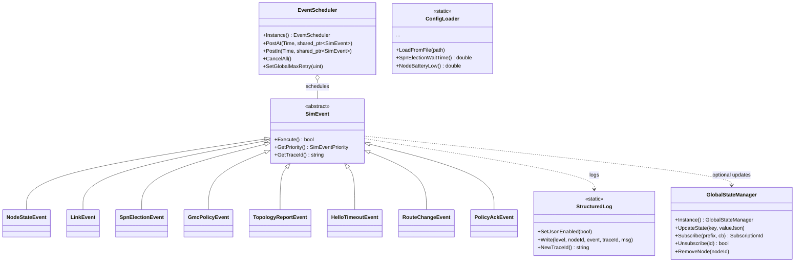

# 异构 NMS 仿真 — 事件驱动与状态架构说明

本文描述在 **保持现有 ns-3 网络与业务功能** 前提下，引入的可扩展内核：**事件调度（优先级队列）**、**全局状态发布订阅**、**统一配置加载**与**结构化日志**。原有 `HeterogeneousNodeApp` / 路由 / GMC 逻辑可 **逐步** 将 `Simulator::Schedule` 迁移到 `hnms::EventScheduler`，将直接读写字段改为 `GlobalStateManager` 订阅。

## 类图（Mermaid）



## 目录与核心文件

| 文件 | 职责 |
|------|------|
| `core/sim_event.h` / `sim_event.cc` | 事件基类与派生类默认 `Execute()`（写状态 + 结构化日志） |
| `core/event_scheduler.h` / `event_scheduler.cc` | 优先级队列 + `Simulator::Schedule` 对接 |
| `core/state_manager.h` / `state_manager.cc` | 全局 KV + 前缀订阅 |
| `core/config_loader.h` / `config_loader.cc` | 读取 `config.json` 嵌套段 |
| `core/structured_log.h` / `structured_log.cc` | JSON 行日志 / 原有 `NmsLog` |
| `core/robustness.h` | 边界检查与 SPN 优先级比较辅助 |

默认配置示例：`docs/heterogeneous-nms/config.json`。

## 启动参数（main / `HnmsMain`）

- `--config=/path/to/config.json`：加载参数（未指定时尝试 `config.json` 与 `docs/heterogeneous-nms/config.json`）。
- `--jsonLog=1`：启用 JSON 行日志（与现有文本日志二选一输出到文件；见 `StructuredLog`）。

## 如何添加一个新的自定义事件

1. **在 `sim_event.h` 中** 声明派生类，重写 `GetTypeName()` 与 `Execute()`。
2. **在 `sim_event.cc` 中** 实现 `Execute()`：  
   - 通过 `GlobalStateManager::Instance().UpdateState(...)` 发布状态；  
   - 通过 `StructuredLog::Write(...)` 打日志，**同一业务链**请复用同一 `trace_id`（从上游事件传入 `SetTraceId`）。  
3. **投递调度**：在仿真逻辑中（或迁移后的模块里）使用：
   ```cpp
   auto ev = std::make_shared<hnms::MyCustomEvent>(...);
   ev->SetPriority(hnms::SimEventPriority::High);
   ev->SetTraceId(existingTraceId); // 可选，贯穿全链路
   hnms::EventScheduler::Instance().PostAt(ns3::Seconds(10.0), ev);
   ```
4. **重试**：基类 `m_maxRetry` 为 0 时使用调度器全局上限；`Execute()` 返回 `false` 且未达上限时，调度器按 1ms 退避重试（可在 `event_scheduler.cc` 中改为可配置）。

## 与现有代码的关系

- **网络栈、OLSR、LTE、应用发包** 未强制替换；新架构为 **并行基础设施**。  
- **渐进迁移**：将 `Simulator::Schedule(..., &HeterogeneousNodeApp::SendPacket, ...)` 等改为向 `EventScheduler` 投递包装事件，或在 `SendPacket` 内发布 `NodeStateEvent`。  
- **子网分裂 / 主备切换 / 三-way handshake**：需在协议层（Hello/TLV）扩展；`robustness.h` 提供优先级比较与 ID 检查，完整握手应作为独立 `SimEvent` 序列实现（后续迭代）。

## TraceId 贯穿示例

1. 检测到 Hello 超时 → 生成 `trace = StructuredLog::NewTraceId()`。  
2. `SpnElectionEvent` 携带 `SetTraceId(trace)`。  
3. 选举结束后 `TopologyReportEvent`、`GmcPolicyEvent` 使用同一 `trace` 写入日志，便于 ELK / 脚本关联。

---

*版本：与 ns-3 异构 NMS scratch 同步维护。*
